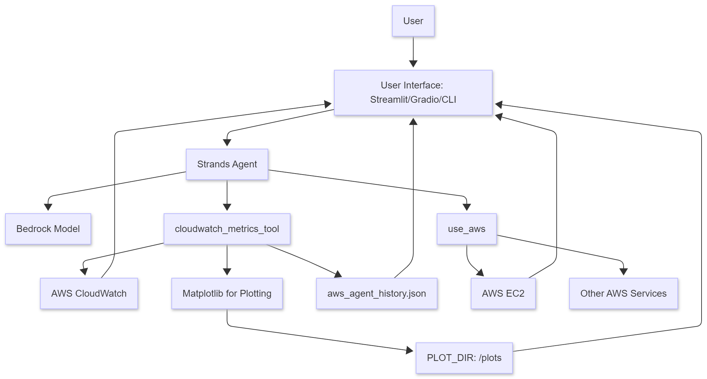

# EC2-monitor-agent

## 1. Description
The EC2-monitor-agent is an intelligent assistant designed to help users monitor and manage their AWS EC2 instances. It leverages AWS CloudWatch metrics to provide insights into CPU utilization and other key performance indicators. The agent can list instances, fetch metrics, and visualize data through plots, making AWS resource management more intuitive.

## 2. Installation
To set up and run the EC2-monitor-agent, follow these steps:

1.  **Clone the repository:**
    ```bash
    git clone https://github.com/AdityaWorkmates/EC2-monitor-agent.git
    cd EC2-monitor-agent
    ```

2.  **Install `uv`:**
    If you don't have `uv` installed, you can install it using:
    ```
    https://docs.astral.sh/uv/getting-started/installation/
    ```

3.  **Run the application:**
    `uv` will automatically resolve and install the dependencies defined in `pyproject.toml`.
    ```bash
    uv run aws_agent_cli.py
    ```
    or for the Gradio UI:
    ```bash
    gradio aws_agent_gradio.py
    ```
    or for the Streamlit UI:
    ```bash
    streamlit run aws_agent_app.py
    ```

## 3. Usage
Once the application is running, you can interact with the agent through the command line or the web interface (Gradio/Streamlit).

**Examples:**
*   `list instances in us-east-1`
*   `show cpu for i-0123456789abcdef in the last 6 hours`
*   `plot cpu utilization for instance 1` (if you have previously listed instances)

## 4. Caution on Creating Environments
It is recommended to use `uv run` as shown above, as `uv` handles dependency resolution and environment management automatically. If you choose to create a virtual environment manually, ensure all dependencies listed in `pyproject.toml` are installed.

## 5. Agent Architecture Diagram
